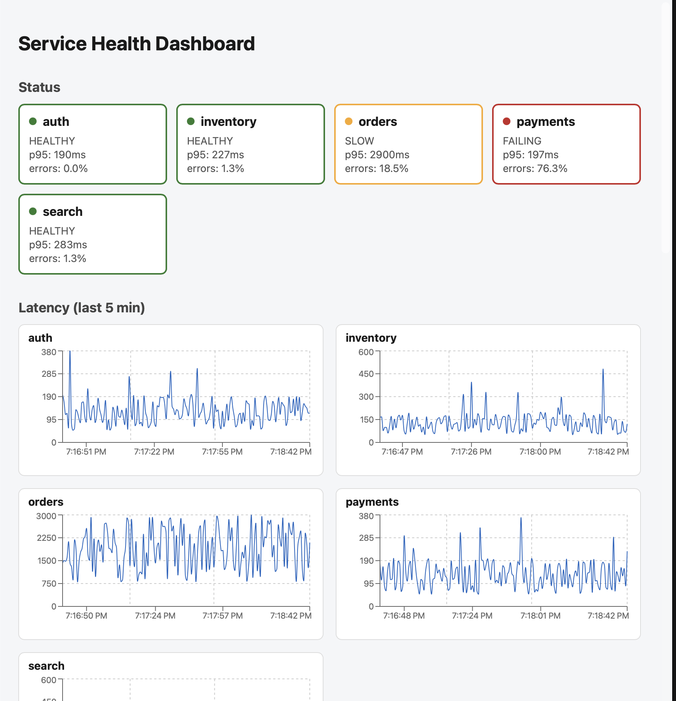
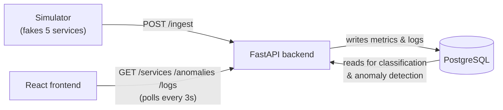

# Distributed System Health & Log Monitoring Dashboard

A full-stack dashboard that watches five simulated microservices (`auth`, `payments`, `orders`, `search`, `inventory`). A Python simulator fakes their traffic — including on-demand failure scenarios — and POSTs it to a FastAPI backend, which classifies each service as **healthy**, **slow**, or **failing** over a rolling window, stores everything in Postgres, and flags statistical anomalies against a trailing baseline. A React frontend polls the read API every few seconds to show live status cards, latency charts, an anomaly feed, and a log viewer.



## Architecture



## Quick start

```bash
cp .env.example .env
docker compose up --build
```

Then open **http://localhost:5173**. `docker compose up` builds and runs all four containers (`db`, `backend`, `frontend`, `simulator`); the backend waits for Postgres to report healthy, then runs Alembic migrations before it starts serving.

## Triggering failure scenarios

Each simulated service reads its scenario from a `SCENARIO_<SERVICE>` env var (`normal`, `latency_spike`, `error_burst`, `silent`, `slow_degradation`). Two ways to set it:

- **Local (no Docker):** set it in `simulator/.env` (see `simulator/.env.example`) and restart `python main.py`.
- **Docker:** run a one-off simulator container with the override, e.g.:
  ```bash
  docker compose run --rm -e SCENARIO_ORDERS=latency_spike simulator
  ```
  Stop it and run `docker compose up -d simulator` to go back to normal traffic.

## Design decisions

**Only 5xx counts as an error.** `ERROR_STATUS_CODE_MIN = 500` in `backend/app/config.py`. A `404` means a caller asked for something that doesn't exist — a client mistake, not evidence the service is unhealthy. Counting it toward `error_rate` would make `failing` trip on bad requests instead of actual backend failures.

**p95 latency, not average.** A mean gets diluted by a large batch of fast requests and hides exactly the tail behavior users notice. p95 answers "how bad is it for the unlucky 1-in-20 request," which is a better proxy for "is this service slow" than a number that one weird fast/slow outlier can swing.

**z-score anomaly detection, with a baseline and a dedupe rule — and a known blind spot.** The current 30s window is compared against a 10-minute trailing baseline sliced into 30s buckets (so the mean/stddev describe per-window values, not raw events), flagging when it exceeds `mean + 3σ`. Anomalies are deduped per `(service, metric)`: an ongoing incident is one row that gets its value/z-score refreshed on each anomalous tick, not a new row every tick, and `resolved_at` closes it the first clean check. The blind spot is `slow_degradation`: because the baseline is trailing, a *gradual* latency creep drags the baseline up right along with the current window, so the gap between them never crosses 3σ. The fix applied for latency (`backend/app/services/anomaly.py`) is a fallback absolute threshold — `SLOW_P95_LATENCY_MS` — so a slow drift still gets flagged once it crosses that fixed line, even though it never "spikes" relative to its own recent history.

**Alembic migrations instead of `Base.metadata.create_all`.** `create_all` only creates tables that don't exist yet — it never alters an existing table, so a database created before a model change (e.g. a new column) silently kept the old schema, and the app crashed against it. Alembic tracks explicit, ordered revisions; `alembic upgrade head` runs automatically at backend startup (`backend/app/main.py`), so any database — a fresh one or one that predates a schema change — gets brought up to the current shape the same way in every environment instead of needing a manual reset.
